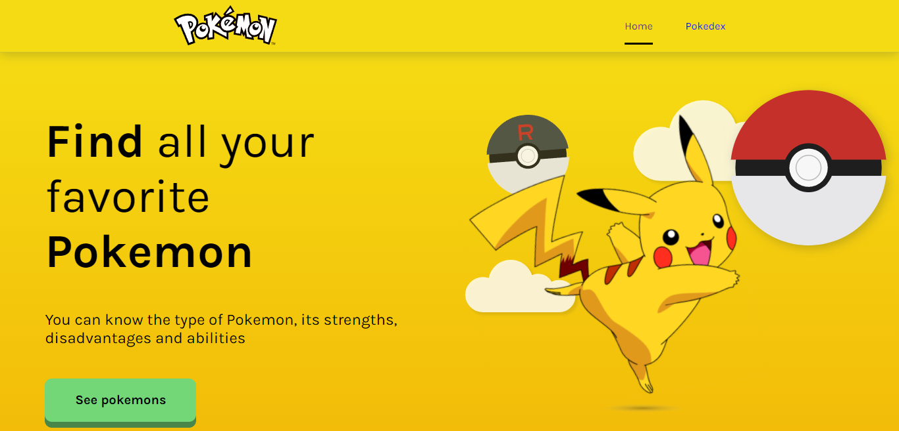

# Next-Pokedex



## 🚀 Tecnologias

Esse projeto foi desenvolvido com as seguintes tecnologias:

- [React](https:/react.org) 
- [Next](https://nextjs.org/)
- [TypeScript](https:/typescriptlang.org)
- [axios](https://axios-http.com/)
- [slick-carousel](https://react-slick.neostack.com/)

# 🧪 Como executar

Clone o projeto e acesse a pasta do mesmo.

```bash

git clone https://github.com/Aldovani/next-pokedex

cd next-pokedex
```

Para iniciá-lo, siga os passos abaixo:

```bash
# Instalar as dependências com yarn
yarn

# Iniciar o projeto
yarn dev

```
